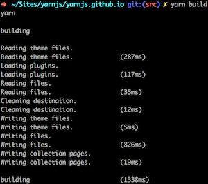

<section class="homeSection">
  <div class="homeSection-block homeSection-blockSmall">

```shell
# Install yarn-cli
npm install -g yarn-cli

# Initialize your new yarn site
mkdir mysite && cd mysite && yarn init

# Build and serve your site!
yarn build && yarn serve
```

  </div>

  <div class="homeSection-block homeSection-blockBig">

### Installation

Installing Yarn locally is as simple as installing an npm module.

After Yarn is installed you can quickly initialize your first Yarn site and build it through two simple CLI commands.

[Read the full getting started instructions](docs/installation/) for an in depth explanation on how to get going with Yarn.

  </div>
</section>


<section class="homeSection">

  <div class="homeSection-block homeSection-blockBig">

### Features

Yarn was built to have feature parity with most mature blogging software.

Out of the box Yarn can paginate your posts along with create tag pages.

You can configure your Yarn site anyway you like. That means [migrating from other systems](/docs/jekyll-to-yarn/) is possible without a full re-write.

There's also theme support that is expressive, flexible, and sharable. You can use all the modern front-end tools to create rich and beautiful designs.

  </div>


  <div class="homeSection-block homeSection-blockSmall homeSection-checkmarkList">

- 100% open source
- Flexible configuration
- Pagination
- Tag support
- Incremental builds
- Markdown by [remarkable](https://github.com/jonschlinkert/remarkable/)
- Template by [nunjucks](http://mozilla.github.io/nunjucks/)
- Themes with support for [LESS](http://lesscss.org/), [SASS](http://sass-lang.com/), [Autoprefixer](https://github.com/postcss/autoprefixer), [Babel](http://babeljs.io/), [Browserify](http://browserify.org/)
- HTML minification by [html-minifier](https://github.com/kangax/html-minifier)

  </div>
</section>


<section class="homeSection">
  <div class="homeSection-block homeSection-blockSmall">



  </div>
  <div class="homeSection-block homeSection-blockBig">

### Fast

Yarn was built to be fast.

There's nothing worse than building a large static site and having to wait until it's done. That's why we're doing everything we can to make builds as fast as possible.

Yarn supports incremental builds, allowing you to re-build your site, only building files that changed.

  </div>
</section>


<section class="homeSection">
  <div class="homeSection-block homeSection-blockBig">

### Open Source

Yarn is 100% open source. It is for and by the community.

All contributions are welcome. [Contribute today!](https://github.com/yarnjs/yarn)

  </div>
</section>
