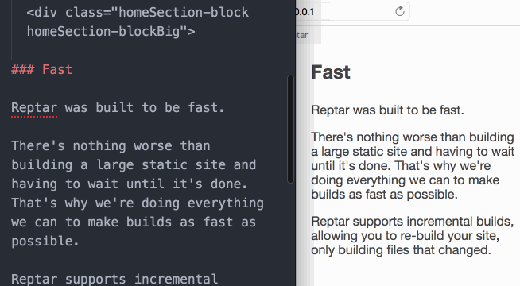

<section class="homeSection">

  <div class="homeSection-block homeSection-blockBig">

### Why Reptar?

Reptar was built to be a modern and feature-rich static site generator.

It should be easy to use out of the box and easy to extend for whatever your use case requires.

Reptar was built to have feature parity with most mature blogging software. Out of the box Reptar can paginate your posts along with create tag pages.

You can configure your Reptar site anyway you like. That means [migrating from other systems](/docs/jekyll-to-reptar/) is easy.

  </div>

  <div class="homeSection-block homeSection-blockSmall homeSection-checkmarkList">

- 100% open source
- Flexible configuration
- Pagination
- Tag support
- Incremental builds
- Markdown by [markdown-it](https://github.com/markdown-it/markdown-it)
- Template by [nunjucks](http://mozilla.github.io/nunjucks/)
- Support for <br/>[LESS](http://lesscss.org/), [SASS](http://sass-lang.com/), [Autoprefixer](https://github.com/postcss/autoprefixer),<br/>[Babel](http://babeljs.io/), [Browserify](http://browserify.org/)
- HTML minification by [html-minifier](https://github.com/kangax/html-minifier)

  </div>
</section>

<section class="homeSection">
  <div class="homeSection-block homeSection-blockBig">

### Installation

Installing Reptar locally is as simple as installing an npm module.

After Reptar is installed you can quickly initialize your first Reptar site and build it through two simple CLI commands.

[Read the full getting started instructions](docs/installation/) for an in depth explanation on how to get going with Reptar.

  </div>
  <div class="homeSection-block homeSection-blockSmall">

```shell
# Install
npm install -g reptar

# Initialize
mkdir mysite && cd mysite && reptar init

# Build and spin up a server!
reptar build && reptar serve
```

  </div>
</section>

<section class="homeSection">
  <div class="homeSection-block homeSection-blockSmall">



  </div>
  <div class="homeSection-block homeSection-blockBig">

### Fast

Reptar was built to be fast.

There's nothing worse than building a large static site and having to wait until it's done. That's why we're doing everything we can to make builds as fast as possible.

Reptar supports incremental builds, allowing you to re-build your site, only building files that changed.

  </div>
</section>


<section class="homeSection">
  <div class="homeSection-block homeSection-blockBig">

### Open Source

Reptar is 100% open source. It is for and by the community.

All contributions are welcome. [Contribute today!](https://github.com/reptar/reptar)

  </div>
</section>
